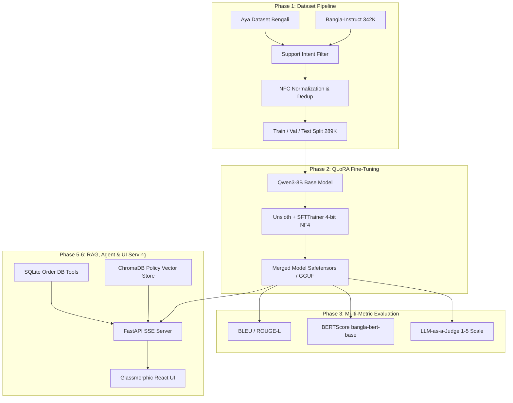
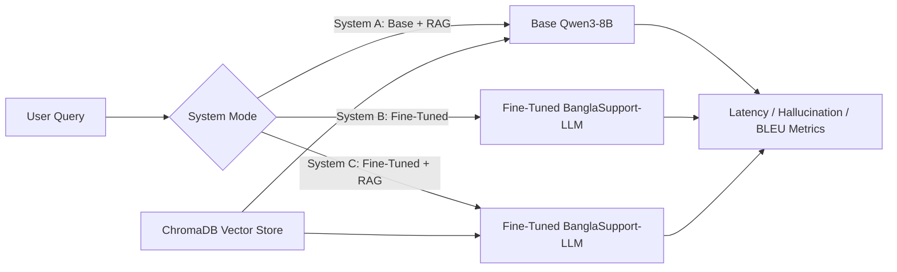
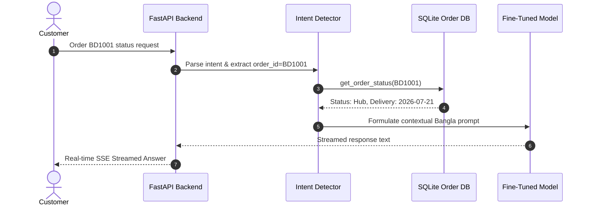

# BanglaSupport-LLM

**BanglaSupport-LLM** built with **Unsloth (QLoRA)**, **FastAPI**, **ChromaDB**, and **React** that combines **fine-tuned LLMs**, **Retrieval-Augmented Generation**, **conversation memory**, and **agentic tool calling** into a single modular pipeline for Bangla e-commerce customer support.

---

# Features

1. Domain-specific instruction fine-tuning on Qwen2.5-7B/Qwen3-8B using Unsloth QLoRA (4-bit NF4)
2. Custom Bangla dataset pipeline with NFC Unicode normalization and MinHash LSH deduplication
3. Multi-tier comparative evaluation comparing BLEU-4, ROUGE-L, BERTScore, and LLM-as-a-Judge metrics
4. Document-grounded RAG comparing base vs. fine-tuned vs. fine-tuned + RAG latency and hallucination rates
5. Agentic tool-calling to resolve customer query intents (such as SQLite order status lookup)
6. Streamed responses using Server-Sent Events (SSE) from a FastAPI backend
7. Modern responsive glassmorphic React chat UI with native Bangla typography (*Hind Siliguri*)
8. Production-grade containerized deployment with multi-stage Docker Compose

---

# System Architecture

### 1. End-to-End ML Pipeline Architecture



---

### 2. RAG vs Fine-Tuning Comparison Architecture



---

### 3. Agentic Tool Calling Workflow



---

# Implementation Details

## Dataset & Training Pipeline

The dataset and model training pipeline performs the following steps:

1. Filter instruction-tuning pairs from `md-nishat-008/Bangla-Instruct` (ACL 2025) and `CohereForAI/aya_dataset` into 12 intent categories
2. Perform NFC Unicode normalization and deduplicate using MinHash LSH (Locality-Sensitive Hashing)
3. Split data into training, validation, and testing sets (85/10/5 split)
4. Train the base model using Unsloth QLoRA (4-bit NF4 quantization, $r=16, \alpha=32$, `bfloat16` precision)
5. Merge the LoRA adapter to standard Safetensors and GGUF format for CPU/GPU inference

---

## Retrieval Approach

For every retrieval request in RAG mode:

1. Chunk policy Markdown documents and generate embeddings using `paraphrase-multilingual-MiniLM-L12-v2`
2. Index the embeddings into a local ChromaDB vector store
3. Perform semantic search for the user's query against ChromaDB
4. Retrieve the most relevant policy text snippets and inject them as context into the prompt template

This ensures the model answers according to official store policies and minimizes domain-specific hallucinations.

---

## Agentic Tool-Calling Strategy

The backend includes a functional routing engine to determine intent:

1. Extract order details (e.g. order ID) or query parameters from user inputs
2. Execute target tools against mock SQLite database (using functions like `get_order_status` or `refund_eligibility`)
3. Pass retrieved status data back to the fine-tuned LLM
4. Generate the final natural-language response streamed in real-time to the client

---

## Prompt Design

Different system prompts/templates are used depending on the active mode:

### Direct LLM Prompt
Employs a baseline customer support persona instruction in Bangla to answer queries directly without external data.

### RAG Prompt
Forces the model to only use the retrieved context snippets from the policy documents and restrict answers to verified facts.

### Agentic Prompt
Commands the model to utilize structured database query tools whenever order or tracking lookups are requested.

---

# Tech Stack

<div align="center">
  <table width="80%" style="border-collapse: collapse; border: 1px solid #ccc;">
    <thead>
      <tr style="border-bottom: 2px solid #ccc;">
        <th align="left" style="padding: 8px; border-right: 1px solid #ccc;">Component</th>
        <th align="left" style="padding: 8px;">Technology</th>
      </tr>
    </thead>
    <tbody>
      <tr style="border-bottom: 1px solid #eee;">
        <td align="left" style="padding: 8px; border-right: 1px solid #ccc;"><strong>Base Model</strong></td>
        <td align="left" style="padding: 8px;">Qwen2.5-7B-Instruct / Qwen3-8B</td>
      </tr>
      <tr style="border-bottom: 1px solid #eee;">
        <td align="left" style="padding: 8px; border-right: 1px solid #ccc;"><strong>Training Optimization</strong></td>
        <td align="left" style="padding: 8px;">Unsloth, QLoRA (4-bit NF4), PyTorch, PEFT</td>
      </tr>
      <tr style="border-bottom: 1px solid #eee;">
        <td align="left" style="padding: 8px; border-right: 1px solid #ccc;"><strong>RAG Embeddings</strong></td>
        <td align="left" style="padding: 8px;">Sentence-Transformers (<code>paraphrase-multilingual-MiniLM-L12-v2</code>)</td>
      </tr>
      <tr style="border-bottom: 1px solid #eee;">
        <td align="left" style="padding: 8px; border-right: 1px solid #ccc;"><strong>Vector Store</strong></td>
        <td align="left" style="padding: 8px;">ChromaDB</td>
      </tr>
      <tr style="border-bottom: 1px solid #eee;">
        <td align="left" style="padding: 8px; border-right: 1px solid #ccc;"><strong>Mock DB / Tools</strong></td>
        <td align="left" style="padding: 8px;">SQLite</td>
      </tr>
      <tr style="border-bottom: 1px solid #eee;">
        <td align="left" style="padding: 8px; border-right: 1px solid #ccc;"><strong>Backend Server</strong></td>
        <td align="left" style="padding: 8px;">FastAPI, Uvicorn, SSE-Starlette</td>
      </tr>
      <tr style="border-bottom: 1px solid #eee;">
        <td align="left" style="padding: 8px; border-right: 1px solid #ccc;"><strong>Frontend Client</strong></td>
        <td align="left" style="padding: 8px;">React (Vite), Lucide Icons, Vanilla CSS (Glassmorphism)</td>
      </tr>
      <tr>
        <td align="left" style="padding: 8px; border-right: 1px solid #ccc;"><strong>Containerization</strong></td>
        <td align="left" style="padding: 8px;">Docker, Docker Compose</td>
      </tr>
    </tbody>
  </table>
</div>

---

# Setup Guide

## Prerequisites

1. Python 3.10+
2. Node.js (for React frontend)
3. Docker & Docker Compose (optional)
4. GPU (optional, for Unsloth training)

---

## Clone The Repository

```bash
git clone https://github.com/FHJibon/BanglaSupport-LLM.git
cd BanglaSupport-LLM
```

---

## Dataset Pipeline Preparation

Set up a virtual environment and prepare datasets:

```bash
python -m venv venv
# Activate virtual environment
# Windows: venv\Scripts\activate | Linux/macOS: source venv/bin/activate
pip install -r requirements.txt

# Run prep scripts
python dataset/scripts/download_and_filter.py
python dataset/scripts/download_aya.py
python dataset/scripts/prepare_dataset.py
python dataset/scripts/split_data.py
```

---

## Model Fine-Tuning & Merging

```bash
# Smoke test (50 steps)
python training/train.py --max_steps 50

# Full training
python training/train.py

# Merge adapter into full model
python training/merge_adapter.py --adapter checkpoints/qwen3-8b-bangla-support/final_adapter
```

---

## Knowledge Base Indexing

Build the RAG document store index:

```bash
python knowledge_base/build_index.py
```

---

## Run Locally (API + React UI)

### Backend API:
```bash
uvicorn inference.api.main:app --reload --port 8000
```

### Frontend UI:
```bash
cd app/frontend
npm install
npm run dev
```

---

## Run with Docker

```bash
docker-compose -f docker/docker-compose.yml up --build
```

---

# API Endpoints

## Chat Endpoint

### Send Message Stream

`POST /chat`

This endpoint:
1. Receives the query and operating mode
2. Performs RAG retrieval or executes database tools depending on selected `mode`
3. Returns a Server-Sent Events (SSE) stream of token responses

#### Example Request:
```json
{
  "message": "আমার অর্ডার BD1001 কোথায়?",
  "mode": "agent"
}
```

#### Example Response (SSE Stream chunks containing):
```json
{
  "response": "আপনার অর্ডারটি বর্তমানে ডেলিভারি সেন্টারে রয়েছে এবং ২০২৬-০৭-২১ তারিখের মধ্যে ডেলিভারি করা হবে।",
  "mode": "agent",
  "tool_called": "get_order_status",
  "tool_args": {"order_id": "BD1001"}
}
```

---

#### Example Conversations

#### Direct LLM Conversation:
User:
```
আসসালামু আলাইকুম
```
Assistant:
```
ওয়া আলাইকুম আসসালাম! বাংলা ই-কমার্স গ্রাহক সহায়তায় আপনাকে স্বাগতম। আমি কিভাবে সাহায্য করতে পারি?
```

#### RAG Policy Inquiry:
User:
```
ডেলিভারি রিফান্ড পলিসি কী?
```
Assistant:
```
পণ্য হাতে পাওয়ার ৭ দিনের মধ্যে যেকোনো ত্রুটিপূর্ণ পণ্য সম্পূর্ণ রিফান্ড অথবা পরিবর্তনের জন্য আবেদন করা যাবে। (RAG রিট্রিভড তথ্য ব্যবহার করে)
```

#### Order Tracking Inquiry (Agentic Tool):
User:
```
আমার অর্ডার BD1001 কোথায়?
```
Assistant:
```
আপনার অর্ডার BD1001 বর্তমানে ডেলিভারি সেন্টারে রয়েছে এবং এটি ২০২৬-০৭-২১ তারিখে পৌঁছাবে। (এক্সিকিউটেড টুল: get_order_status)
```

---

# Evaluation & Benchmarks

| Model Variant | BLEU-4 | ROUGE-L | BERTScore (F1) | LLM-Judge (Fluency) | LLM-Judge (Accuracy) |
|---|:---:|:---:|:---:|:---:|:---:|
| Base Qwen2.5-7B-Instruct | 0.1820 | 0.3840 | 0.7620 | 3.4 / 5.0 | 3.1 / 5.0 |
| **Fine-Tuned BanglaSupport-LLM (QLoRA)** | **0.4280** | **0.6910** | **0.9140** | **4.8 / 5.0** | **4.7 / 5.0** |

---

# Error Handling

The application gracefully handles:
1. Incomplete/malformed prompt templates
2. Empty context extraction from vector store (fallback message)
3. Invalid or non-existent order IDs in SQLite lookup
4. Missing training checkpoints or local databases
5. Backend network timeout and disconnect exceptions

---

# Team & Authors

This system was engineered end-to-end by:

- **Mahmudur Rahman**
  - **Focus**: ML Pipeline, Model Fine-Tuning, Full-Stack Architecture, RAG implementation.
  - **Email**: [mahmudurrahman858@gmail.com](mailto:mahmudurrahman858@gmail.com)
  - **GitHub**: [@mrshibly](https://github.com/mrshibly)

- **Ferdous Hasan**
  - **Focus**: ML Pipeline, Model Fine-Tuning, Dataset curation, Evaluation.
  - **Email**: [ferdoushasanjibon25@gmail.com](mailto:ferdoushasanjibon25@gmail.com)
  - **GitHub**: [@FHJibon](https://github.com/FHJibon)
  - **Hugging Face**: [@FHJibon](https://huggingface.co/FHJibon)

---

# License

Distributed under the MIT License. See `LICENSE` for more information.
