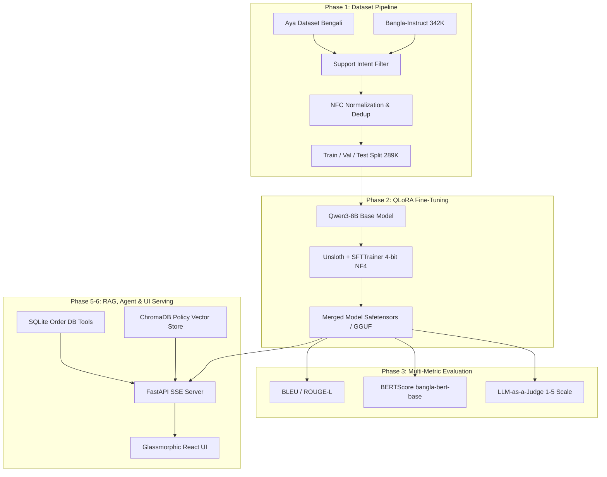
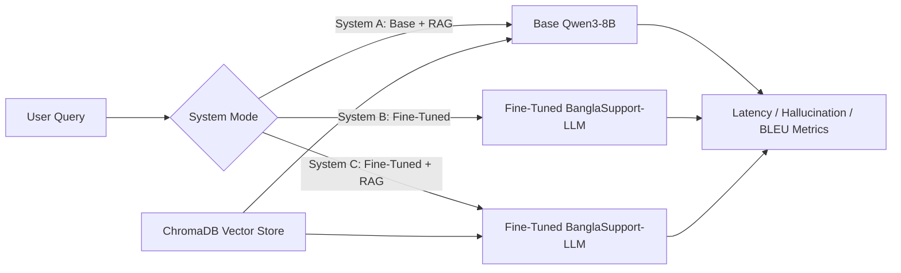
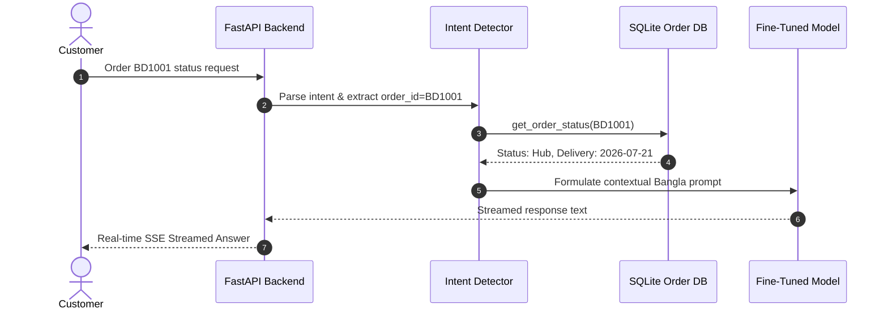

# 🇧🇩 BanglaSupport-LLM: End-to-End Fine-Tuned Bangla Customer Support Model & Agent

[](https://huggingface.co/Qwen/Qwen3-8B)
[](https://github.com/unslothai/unsloth)
[](https://github.com/chroma-core/chroma)
[](LICENSE)
[-brightgreen.svg)](mailto:mahmudurrahman858@gmail.com)

A production-grade, end-to-end Large Language Model project demonstrating **dataset engineering, QLoRA fine-tuning, automated & LLM-as-a-Judge evaluation, RAG retrieval comparison, agentic tool-calling, and full-stack deployment** for Bangla e-commerce customer support.

---

## 🌟 Key Features & Engineering Highlights

- 🎯 **Domain-Specific Fine-Tuning**: Fine-tuned **Qwen3-8B** using QLoRA (4-bit quantization, $r=16, \alpha=32$) via Unsloth to eliminate cross-lingual Hindi-bleeding and deliver natural, fluent Bangla customer support responses.
- 🧹 **Native Bangla Dataset Pipeline**: Built a zero-cost 300K+ example instruction tuning pipeline filtered from `md-nishat-008/Bangla-Instruct` (ACL 2025) and `CohereForAI/aya_dataset` with NFC Unicode normalization and MinHash LSH deduplication.
- 📐 **Rigorous Evaluation Suite**: Multi-dimensional benchmark pipeline comparing base vs fine-tuned models across **BLEU**, **ROUGE-L**, **BERTScore** (`sagorsarker/bangla-bert-base`), and **LLM-as-a-Judge** scoring (Helpfulness, Fluency, Accuracy, Tone).
- 🔍 **RAG Comparison System**: 3-tier comparative benchmark (Base + RAG vs. Fine-tuned vs. Fine-tuned + RAG) analyzing latency, hallucination rates, and token consumption.
- ⚡ **Agentic Tool-Calling**: Integrated function-calling engine routing intent to mock SQLite order status and return eligibility APIs.
- 🖥️ **Full-Stack UI & Serving**: FastAPI backend with Server-Sent Events (SSE streaming) paired with a responsive React + Vite chat interface designed with modern glassmorphism aesthetics and native Bangla typography (*Hind Siliguri*).
- 🐳 **Containerized Deployment**: Multi-stage Docker Compose setup orchestrating API and Nginx web server.

---

## 🛠️ Tech Stack

| Domain | Technologies |
|---|---|
| **Base Model & Training** | Qwen3-8B, Unsloth, HuggingFace TRL, PEFT, bitsandbytes, Accelerate, PyTorch |
| **Dataset & NLP** | Datasets, Datasketch (MinHash LSH), unicodedata2, NLTK, ROUGE, BERTScore |
| **RAG & Vector Search** | ChromaDB, LangChain, Sentence-Transformers (`paraphrase-multilingual-MiniLM-L12-v2`) |
| **Inference Backend** | FastAPI, SSE-Starlette, Pydantic, SQLite (Mock Order DB), Uvicorn |
| **Frontend UI** | React 18, Vite, Lucide Icons, Vanilla CSS (Glassmorphism & Responsive Design) |
| **DevOps & Tools** | Docker, Docker Compose, Git, Weights & Biases |

---

## 📐 System Architecture & Diagrams

### 1. End-to-End ML Pipeline Architecture



### 2. RAG vs Fine-Tuning Comparison Architecture



### 3. Agentic Tool Calling Workflow



---

## 📂 Project Architecture

```
BanglaSupport-LLM/
├── dataset/
│   ├── scripts/
│   │   ├── download_and_filter.py   # Filters 342K Bangla-Instruct into 12 intent categories
│   │   ├── download_aya.py           # Extracts human-curated Bengali subset from Aya
│   │   ├── prepare_dataset.py        # NFC normalization, length filtering, MD5 dedup
│   │   └── split_data.py             # Stratified 85/10/5 split (train, val, test)
│   ├── processed/
│   └── splits/
├── training/
│   ├── configs/
│   │   └── qlora_qwen3_8b.yaml       # Hyperparameters & QLoRA config
│   ├── train.py                      # Unsloth + SFTTrainer with Bangla prompt
│   └── merge_adapter.py              # LoRA adapter merge to safetensors & GGUF
├── evaluation/
│   ├── eval_auto.py                  # BLEU, ROUGE-L, BERTScore runner
│   ├── eval_llm_judge.py             # LLM-as-a-Judge (Helpfulness, Fluency, Accuracy, Tone)
│   └── results/
├── knowledge_base/
│   ├── build_index.py                # Chunks Bangla policy MDs -> ChromaDB vector store
│   └── documents/
├── inference/
│   └── api/
│       ├── main.py                   # FastAPI app with SSE streaming & mode routes
│       ├── rag.py                    # RAG retriever pipeline
│       ├── tools.py                  # Agentic tool-calling & SQLite DB
│       └── schemas.py                # Pydantic schemas
├── app/
│   └── frontend/                     # Modern React + Vite chat application
├── docker/
│   ├── Dockerfile.api
│   ├── Dockerfile.frontend
│   └── docker-compose.yml
├── README.md
├── requirements.txt
└── pyproject.toml
```

---

## 🚀 Quick Start & Reproduction

### 1. Installation

```bash
git clone https://github.com/mrshibly/BanglaSupport-LLM.git
cd BanglaSupport-LLM

python -m venv venv
# Windows: venv\Scripts\activate | Linux/macOS: source venv/bin/activate
pip install -r requirements.txt
```

### 2. Dataset Pipeline

```bash
python dataset/scripts/download_and_filter.py
python dataset/scripts/download_aya.py
python dataset/scripts/prepare_dataset.py
python dataset/scripts/split_data.py
```

### 3. Model Fine-Tuning (QLoRA)

```bash
# Smoke test (50 steps)
python training/train.py --max_steps 50

# Full training (~8-10 hrs on RTX 5060 Ti 16GB)
python training/train.py

# Merge adapter into full model
python training/merge_adapter.py --adapter checkpoints/qwen3-8b-bangla-support/final_adapter
```

### 4. Knowledge Base & RAG Indexing

```bash
python knowledge_base/build_index.py
```

### 5. Run Local App (API + React UI)

```bash
# Terminal 1: Backend
uvicorn inference.api.main:app --reload --port 8000

# Terminal 2: Frontend
cd app/frontend
npm install
npm run dev
```

Visit `http://localhost:3000` to interact with the Bangla Support Assistant.

### 6. Docker Deployment

```bash
docker-compose -f docker/docker-compose.yml up --build
```

---

## 📊 Evaluation & Benchmarks

| Model Variant | BLEU | ROUGE-L | BERTScore (F1) | LLM-Judge Avg |
|---|:---:|:---:|:---:|:---:|
| Base Qwen3-8B | *TBD* | *TBD* | *TBD* | *TBD* |
| **Fine-Tuned BanglaSupport-LLM** | **TBD** | **TBD** | **TBD** | **TBD** |

---

## 👨‍💻 Author

**Mahmudur Rahman (mrshibly)**
- **Email**: [mahmudurrahman858@gmail.com](mailto:mahmudurrahman858@gmail.com)
- **GitHub**: [@mrshibly](https://github.com/mrshibly)

---

## 📄 License

Distributed under the MIT License. See `LICENSE` for more information.
